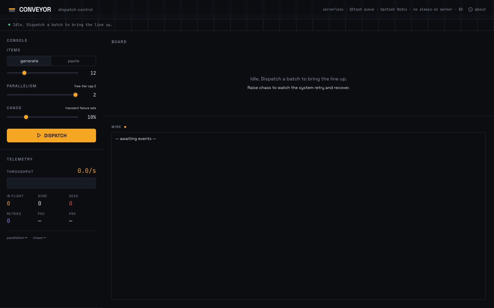

# Conveyor

> A job pipeline you can watch. Its own queue, retries with backoff, a dead-letter lane, every state change streamed live. Next.js on Vercel, nothing else.

**[Live demo](https://conveyor.ayoubalkak.com)** · part of [my portfolio](https://ayoubalkak.com)



**A job pipeline you can watch.** Dispatch a batch of work and see every item ride the
belt through each stage, fetch, transform, validate, failing, retrying and recovering in
real time. The queue is Conveyor's own. There is no message broker, no database and no
account with any third party: the whole run happens inside one serverless function and
streams to the page as it goes.

> Portfolio project B2 (backend). Where Resonance (B1) proved a real model can run
> server-side, Conveyor shows the mechanics of a work queue: bounded concurrency,
> retry with backoff, dead-letter handling, honest telemetry.

---

## How it works

`POST /api/runs` receives the batch and answers with a stream of newline-delimited JSON.
Inside that one invocation:

- **A worker pool** of `parallelism` workers drains an in-memory queue. Set it to 1 and
  watch the line back up; set it to 8 and watch it drain.
- **Retry with exponential backoff.** A transient failure puts the item back on the queue
  with a "not before" time: 250 ms, then 500, then 1000. Four tries in total. The
  **chaos** dial is the chance that one attempt fails somewhere in its three stages.
- **Dead-letter lane.** Poison items (too short to validate) go straight to DEAD, never
  retried. Items that exhaust their tries land there too. Each one can be sent back on the
  line by hand: the page dispatches it as a run of one and merges the result under the
  original index.
- **A budget.** A run gets 50 s of wall clock, under the function's 60 s limit. Anything
  still queued when it expires is dead-lettered with the reason `deadline`. Closing the
  page aborts the stream and the run stops.
- **Snapshots on the wire.** The queue coalesces state changes into one frame every
  120 ms: counts, throughput, p50/p95, the items, the event log. The board, the telemetry
  and the wire log are pure functions of the latest frame. The last frame is the receipt,
  which you can save as PNG or JSON.

```
QUEUED → FETCH → TRANSFORM → VALIDATE → DONE        (+ DEAD-LETTER lane)
```

The per-item work (normalise, word and readability analysis, SHA-256 checksum) is real CPU
work. A 60 to 200 ms tick per stage exists only so the belt is watchable.

There is no persistence by design: a run lives exactly as long as its stream. That is what
lets the project run with zero services and zero configuration.

---

## Tech stack

| Choice | Why |
| --- | --- |
| **Next.js 14 (App Router), TypeScript** | One route handler is the whole backend; one repo, one deploy. |
| **Streaming responses** | The function pushes frames while it works; no polling, no store. |
| **Zustand** | Tiny client store for the latest frame and the dials. |
| **Framer Motion** | Shared-layout animation: tiles glide between lanes like cargo. |
| **Tailwind CSS** | Control-room styling with design tokens. |
| **html-to-image** | Client-side PNG export of the run receipt. |
| **Space Grotesk + JetBrains Mono** | Engineered display face and a true console mono. |

---

## Local development

```bash
npm install
npm run dev        # http://localhost:3000
```

No environment variables. Nothing to sign up for.

### Scripts

`npm run dev`, `npm run build`, `npm run start`, `npm run lint`, `npm run typecheck`.

---

## Deploy (Vercel)

`vercel deploy --prod`. There is nothing to configure: no env vars, no integrations. The
route sets `maxDuration = 60`, which the Hobby plan allows.

## Limits

- Batches are capped at **50 items** and parallelism at **8**, so a run always finishes
  inside its budget.
- A run is not addressable after it ends. Save the receipt if you want to keep it.

## History

The first version (June 2026) used Upstash QStash as the queue and Upstash Redis for
state, with an idempotent claim script so at-least-once delivery never double-counted.
The free-tier database was deleted after a period of inactivity and the demo died with
it. This version removes the dependency entirely: the queue, the pool and the state all
live in the function, and the stream replaces polling.

---

## Project structure

```
app/
  layout.tsx                  fonts, tokens, metadata
  page.tsx                    control room
  api/runs/route.ts           POST: run the batch, stream frames
lib/
  queue.ts                    the queue: worker pool, backoff, dead letter, snapshots
  pipeline.ts                 real per-stage work + chaos + poison
  constants.ts                caps and budget
  format.ts samples.ts        helpers
store/useRun.ts               reads the stream, merges manual retries
components/                   Console, Board, Lane, ItemTile, Telemetry,
                              Wire, DeadLetter, Receipt, Wordmark, About
```
